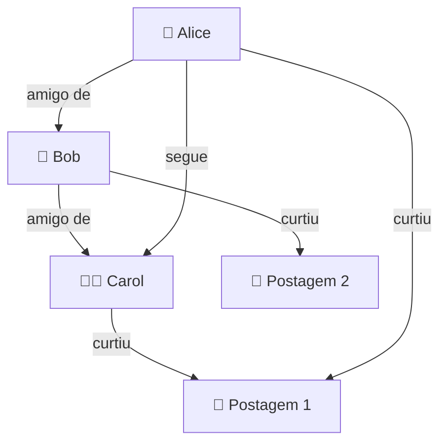
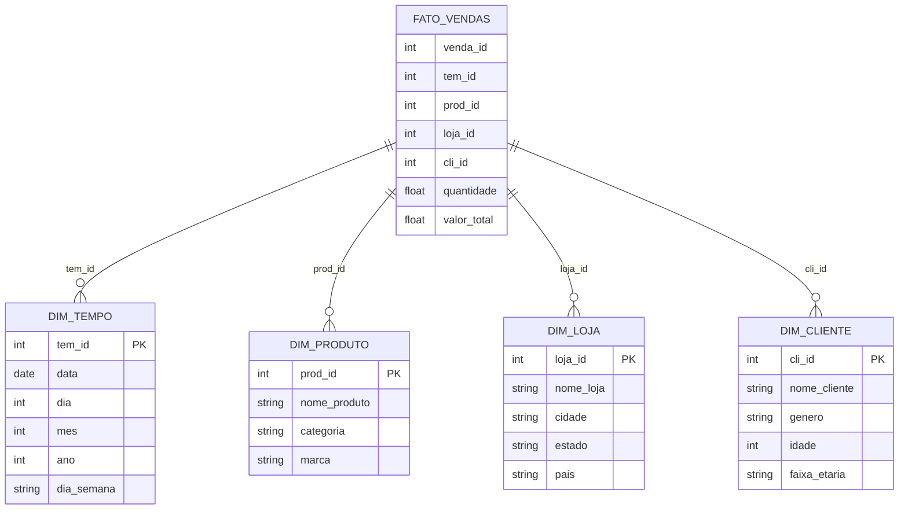

Planos de aula Modelagem e Projeto de Banco de Dados

- [1. Turma: Modelagem e Projeto de Banco de Dados](#1-turma-modelagem-e-projeto-de-banco-de-dados)
  - [1.1. Carga Horária Total: 60](#11-carga-horária-total-60)
  - [1.2. Horário: 19hs - 22hs](#12-horário-19hs---22hs)
  - [1.3. Ementa](#13-ementa)
  - [1.4. Metodologia](#14-metodologia)
  - [1.5. Procedimentos de avaliação de aprendizagem](#15-procedimentos-de-avaliação-de-aprendizagem)
  - [1.6. Horário de atendimento](#16-horário-de-atendimento)
- [2. Sites utilizados](#2-sites-utilizados)
- [3. Repositórios de apoio](#3-repositórios-de-apoio)
- [4. Datas de aulas e conteúdo](#4-datas-de-aulas-e-conteúdo)
- [5. Unidades de avaliações](#5-unidades-de-avaliações)
- [6. Links para download de ferramentas](#6-links-para-download-de-ferramentas)
- [7. Artigos](#7-artigos)
- [8. Livros](#8-livros)
- [9. Cursos gratuítos](#9-cursos-gratuítos)
- [10. Como estudar](#10-como-estudar)
- [11. Grupos no telegram](#11-grupos-no-telegram)
- [12. Videos recomendados](#12-videos-recomendados)
- [Outros assuntos](#outros-assuntos)

---
## 1. Turma: Modelagem e Projeto de Banco de Dados

### 1.1. Carga Horária Total: 60

### 1.2. Horário: 19hs - 22hs

### 1.3. Ementa

* Conceitos sistemas de gerenciamento de banco de dados;
* Níveis de arquiteturas de banco de dados; 
* Modelo Relacional: Conceitos;
* Restrições e Normalização; 
* Modelos de banco de dados não-relacional.

### 1.4. Metodologia

* Aulas expositivas, dialogadas, com apresentação de conceitos teóricos/práticos.
* Aulas com comentários de casos de interesse correlatos e comentários sobre eventuais produtos e tecnologias relacionadas ao tema da disciplina. 
* Aulas complementares, faltantes ou remotas(EaD), serão atribuidas com conteúdos disponíveis na plataforma SIGAA.

### 1.5. Procedimentos de avaliação de aprendizagem

**Prova presencial** escrita objetiva de múltipla escolha. Cálculo de notas por soma de pontos simples. Cada avaliação vale 10 pontos. São 3 avaliações. Resultado final via média simples entre avaliações. Excepcionalmente poderão ocorrer avaliações online. Poderão ocorrer atividades online objetivando fixação de conceitos (valendo pontos ou não).

**Provas de 2ª chamada** devem ser requisitas dentro do prazo e formalmente conforme regras da faculdade. A prova de 2ª chamada é discursiva, escrita (tipo canetão).

A **carga horária remota/EAD** será realizada via: a) leitura de artigos postados pelo professor (ou videos correlatos aos assuntos abordados em sala); b) exercícios disponíveis na plataforma EaD da instituição ou c) envio de trabalho, conforme o caso. Este material também poderá estar na sua avaliação presencial escrita. O material usado nas atividades EAD será disponibilizado no site do professor e na página da disciplina no SIGAA e no github.

A **1ª avaliação** terá o conteúdo das aulas de 1 a 5.

A **2ª avaliação** terá o conteúdo das aulas 6 a 9.

A **3ª avaliação** terá o conteúdo das aulas 11 a 14 e os artigos selecionados.

Temos 15 encontros presenciais, sequênciais, 1 ves por semana; nos encontros 5, 10 e 15, teremos as avaliações.

**Notas:** Cada uma das três avaliações vale 0 à 10,0. A média final da disciplina é feita fazendo média aritmética simples entre as notas obtidas. O aluno será considerado aprovado se atingir média igual ou superior a 6,0. Alunos com nota >= 4,0 e < 6,0 têm direito à nota de exame final. 

**Prova final:** (PF) ou exame final será aplicado após a avaliação 3. A avaliação poderá **escrita** objetiva (tipo canetão). O conteúdo será... **TODO** o conteúdo ministrado ao longo do semestre. A prova final deve ser requisitada na Secretaria Acadêmica.

### 1.6. Horário de atendimento

No dias de aula da disciplina. 30 minutos antes da aula (via agendamento prévio pelo sistema SIGAA).

---
## 2. Sites utilizados

|Sites utilizados|Url|
|-----|-----|
|Site do professor	| https://www.pontodeensino.com |
|Site das disciplinas | https://sites.google.com/unemat.br/professoremiliano |
|Sites das disciplinas no github | https://github.com/monteiro74/aulas_2025_1 |
|Sistema Acadêmico | https://sigaa.unemat.br/sigaa/verTelaLogin.do|
| Link Tree do curso | https://linktr.ee/si.unemat |
| Página do curso | https://sinop.unemat.br/faculdades/facet/graduacao/sistemas-de-informacao-bacharelado-graduacao-presencial-noturno-sinop |

---
## 3. Repositórios de apoio

|Sites utilizados|Url|
|-----|-----|
| Resumo de diagramas para Engenharia de Software | https://github.com/monteiro74/diagramas_resumo  |
| Lista de ferramentas | https://github.com/monteiro74/lista_de_ferramentas |

---
## 4. Datas de aulas e conteúdo

|Aula | Data   | Carga horária| Conteúdo |
|-----|--------|--------------|----------|
| 1   | 06/mar | 3hs | Apresentação da disciplina, conceitos básicos sobre bancos de dados, referências bibliográficas. [Slides da aula 1](https://docs.google.com/presentation/d/1k2S8-ciWdA36AHM13OM1-yuJUCzB5jlZlgVFjLHHRNY/view)e [referências bibliográficas](https://docs.google.com/presentation/d/1StFHjTjcc9mpTTDoWmMHJibmx2n17o8FLwxMhHskXZo/view), [Ranking de bancos de dados](https://docs.google.com/presentation/d/1d9IFPUf_Pc4PV1Q8Vrq46xc_5BxJyFlbQdepoCTIcZg/view).  |
|  2  | 13/mar | 3hs | Comparativo SGBD x Arquivo de dados. Níveis da arquitetura. Métodos de acesso. Processamento de software. Conceitos de BD e SGBD, Comparações com SO e arquivos. Estrutura interna. [Slides da aula 2](https://docs.google.com/presentation/d/1Q8MyeK5AGzpnQ2yHfWyzstUnkgXiQeJxDYm6Up1Nzr0/view). [Scripts SQL p/ MySQL e SQL Server](https://github.com/monteiro74/aulas_2025_1/tree/main/Modelagem_de_projeto_BD). |
| 3  | 20/mar  | 3hs | Conceito de transação. ACID. Concorrência. Logs. Trilhas de auditoria. Bloqueio e impasse. Intro. Modelo ER. [Detalhes do SQL Server](https://docs.google.com/presentation/d/1uHECTMhqvmWZwq8FGt-_9UGawGFrTfSnWb28YGy8Of8/view). [Conhecendo o SSMS](https://docs.google.com/presentation/d/1TnanbvGRm8B0Kn_b9BB3GSLUgq65gkmlEskGpJk7QP0/view). [Monitorando o SQL Server e propriedades do servidor](https://docs.google.com/presentation/d/1cwH2mM63vV5QxTIipVqGLdmWvwDal8SLZwG7hAuv5nY/view). [Slides da aula 3](https://docs.google.com/presentation/d/1TdDhVu5FDH-svhK1HecBWRPBAnkfGgp6DKsxhiaFemQ/view). [Segurança de aplicações](https://docs.google.com/presentation/d/1oW90UpNWErX7yvV3oBtBBgHvMPJuYnXWZMHvzkl09To/view). [Threads](https://docs.google.com/presentation/d/1zXQdDfjkuTqLSq8I1RmeEkz_H3RDJIBNZabzfW6vZGg/view). |
| 4   | 27/mar | 3hs | Modelo ER, criação de tabelas e diagramas no SSMS, Join no SQL Server.  Criação de tabelas e diagramas no SQL Server. Joins no SQL Server. [SQL Server, criação de tabelas](https://docs.google.com/presentation/d/1WUcHWo3uwYIhLZAfp_-I0LiEPOwCKlLhf18IHdh8I8I/view), [Modelo de dados relacional](https://docs.google.com/presentation/d/1PAWy0t3O0Un5vwTfP_Zex4ZblXRLg4weeor8NDeYm6c/view), [SQL Joins no SQL Server](https://docs.google.com/presentation/d/1mwNJbEtrn_JaRL7ujMjtijDwjzh5E7Ljmi9PClNyrGI/view). |
| 5   | 03/abr | 3hs | **Avaliação 1**.  |
| 6   | 10/abr | 3hs | <!-- Normalização. Revisão de modelo ER. Revisão do modelo ER. Normalização. SQL Joins.. Objetos do banco. Conexão ODBC. Conexão do Excel com SQL Server. Conectando LibreOffice via ODBC: ctrl + shift + F4. Conceitos de ODBC. Detalhes ODBC. --> Normalização. Revisão de modelo ER. Conceitos de ODBC. Conexão ODBC com Power BI e Excel. [ODBC](https://docs.google.com/presentation/d/1fRHFyps9MnBF_eIAlIEKk73S-bTrAPlImunOi68BAkE/view). [DW, BI](https://docs.google.com/presentation/d/1gvXrmCMsLwHKwgSqhFKVFs4niW3XlRg6cK1ebdLtqZE/view). [Importação de dados do Excel p/ SQL Server](https://docs.google.com/presentation/d/1OhPqv-H0wK5WUS2gcWWVrlc4jrs4R0HfnvvmBnWMle4/view). [Objetos do banco SQL Server](https://docs.google.com/presentation/d/1OhPqv-H0wK5WUS2gcWWVrlc4jrs4R0HfnvvmBnWMle4/view).|
| 7   | 17/abr | 3hs | <!-- Criação de conta de usuário. Importação dados (uma tabela do Excel) e flat file (texto puro em csv). Resultado do exercício PowerBI. Arquivo do exercício com PowerBI. Tutorial de Power BI. Tutorial de importação de flat file. Importação de planilha Excel. --> |
| 8   | 24/abr | **4hs** | <!-- Dataware house, BI, modelo estrela e floco de neve, slides de aula. Orange Data Mining. Backup e Restore no SQL Server. Tabela dinânica (pivot table). --> |
| 10  | 08/mai | 3hs | <!-- **Avaliação 2** -->.  |
| 11  | 15/mai | 3hs | **Avaliação 2**. <!-- Introdução aos bancos NoSQL: CouchDB e MongoDB. Revisão para prova. Arquivos em json estão disponíveis nesta página. Criptografia no SQL Server. Exercício de modelagem (mineradora). Migration Assistant. NoSQL. --><!-- Blockchain. Diagrama ER no DBeaver. SQL Server ledger table. Script SQL Server ledger table. Hyperledger no projeto DREX. Repositório sugerido sobre blockchain. Exemplo com Multichain blockchain. Artigo sobre ontologia. --> |
| 12  | 22/mai | **4hs** | <!-- Blockchain, camada 2, sidechain, BSN.  --> |
| 13  | 29/mai | **4hs** | <!-- AdventureWorksLT (Lightweight) full database backups. Bancos de dados distribuídos, replicação de BD, Python com SQL Server. --> |
| 14  | 05/jun | 3hs | <!-- Banco vetorial, SQL Server Profiler. --> |
| 15  | 12/jun | 3hs | **Avaliação 3**, entrega de notas, revisão para PF. |

## 5. Unidades de avaliações

* Avaliação 1: 03/04/2025
* Avaliação 2: 15/05/2025
* Avaliação 3: 12/06/2025

---
## 6. Links para download de ferramentas

1. [Laragon](https://laragon.org/download/)
2. [Heidi SQL](https://www.heidisql.com/download.php)
3. [MS Sql Server Express 2022](https://go.microsoft.com/fwlink/p/?linkid=2216019&clcid=0x416&culture=pt-br&country=br)
4. [MS Sql Server Management Studio](https://learn.microsoft.com/pt-br/sql/ssms/download-sql-server-management-studio-ssms?view=sql-server-ver16)
5. [Visual Studio Code](https://code.visualstudio.com/download)
6. [Github Desktop](https://desktop.github.com/download/)
7. [DBeaver Community](https://dbeaver.io/download/)
8. [CouchDB](https://couchdb.apache.org/)
9. [MongoDB](https://www.mongodb.com/products/self-managed/community-edition)

* Ferramenta para pesquisa:  https://github.com/langchain-ai/local-deep-researcher

---
## 7. Artigos

Diagrama Entidade-Relacionamento: uma ferramenta para modelagem de dados conceituais em Engenharia de Software
https://rsdjournal.org/index.php/rsd/article/download/17776/15626/221575

O uso da abordagem sistêmica na modelagem de banco de dados
https://www.aedb.br/seget/arquivos/artigos12/65416864.pdf

Uma proposta de aplicação de business intelligence no chão-de-fábrica
https://www.scielo.br/j/gp/a/ydtVGxxBtD65zcx4VmJDJGw/?format=pdf

Os desafios da administração pública na disponibilização de dados sensíveis
https://www.scielo.br/j/rdgv/a/GCMwrvnHzP4mJD3xZKNsnTq/?format=pdf

---
## 8. Livros

* ELMASRI, Ramez; NAVATHE, Shamkant B. Sistemas de Banco de Dados. 6 a edição. Editora Addison, 2005.

* SILBERSCHATZ, Abraham; KORTH, Henry F.; SUDARSHAN, S. Sistema de banco de dados. Trad. Daniel Vieira. 6ed. Rio de Janeiro: Elsevier, 2012.
Este livro esta disponível na biblioteca online da Unemat em: https://integrada.minhabiblioteca.com.br/reader/books/9788595157552/epubcfi/6/2[%3Bvnd.vst.idref%3Dcover]!/4/2/2%4074:39

* DATE, Christopher J. Introdução a sistemas de bancos de dados. Elsevier Brasil, 2004.
Este livro esta disponível na biblioteca online da Unemat em: https://integrada.minhabiblioteca.com.br/reader/books/9788595154322/epubcfi/6/2[%3Bvnd.vst.idref%3Dcapa.xhtml]!/4/2/2/4%4074:84

* MEDEIROS, Marcelo. Banco de dados para sistemas de informação. Visual Books. 2006.

* SETZER, V. W., SILVA, F. S. C. Banco de dados: aprenda o que são, melhore seu conhecimento, construa os seus. São Paulo: Edgard Blücher, 2005.
Este livro esta disponível na biblioteca online da Unemat em: https://integrada.minhabiblioteca.com.br/#/books/9788521216520/recent

* MONTEIRO, Emiliano Soares. Projeto de sistemas e bancos de dados. Rio de Janeiro: Brasport, 2004. 321. ISBN: 8574521760.

Referências na biblioteca virtual:
[referências bibliográficas](https://docs.google.com/presentation/d/1StFHjTjcc9mpTTDoWmMHJibmx2n17o8FLwxMhHskXZo/view).

---
## 9. Cursos gratuítos

* [Projeto Real Der(conceitual) com Banco de dados SQL SERVER](https://www.udemy.com/course/projeto-real-derconceitual-com-banco-de-dados-sql-server/)

* [Série DBA SQL Server - Preparação, instalação e configuração](https://www.udemy.com/course/sqlserver-instalacao-e-configuracao/)

* [Microsoft SQL for Beginners (SQL Server and T-SQL)](https://www.udemy.com/course/microsoft-sql-for-beginners-sql-server-and-t-sql/)

* [Introdução a banco de dados com MySQL & PHPMyAdmin](https://www.udemy.com/course/mysql_phpmyadmin/)

* [Introdução a Bancos de Dados e Linguagem SQL](https://www.udemy.com/course/introducao-a-bancos-de-dados-e-linguagem-sql/)

* [Como conectar com o SQL Server (Lesson 1: Connecting to the Database Engine)](https://learn.microsoft.com/en-us/sql/relational-databases/lesson-1-connecting-to-the-database-engine?view=sql-server-ver16)

* [Conectando e realizando consultas no SQL Server(Quickstart: Connect and query a SQL Server instance using SQL Server Management Studio (SSMS))](https://learn.microsoft.com/en-us/sql/ssms/quickstarts/ssms-connect-query-sql-server?view=sql-server-ver16)

* [Introdução à análise de dados da Microsoft](https://learn.microsoft.com/pt-br/training/powerplatform/power-bi).

---
## 10. Como estudar

3 técnicas indicadas por cientistas para qualquer pessoa melhorar nos estudos
https://www.youtube.com/watch?v=posTc56basM

As formas mais eficientes de estudar para prova
https://www.youtube.com/watch?v=1y0xBcGZJmk

---
## 11. Grupos no telegram

|Grupo | Link no Telegram |
| --- | --- |
| Vagas de TI para todos | https://t.me/vagastibr |
| Flutterflow Brasil | https://t.me/flutterflowbrazil |
| Bubble.ioBR | https://t.me/bubbleBR |
| Grupo de usuários Oracle Cloud Brasil | https://t.me/GUOCB |
| PHP Brasil | https://t.me/phpbrasil |
| Lazarus & Delphi Brasil | https://t.me/LazBrasil |
| Lazarus BR | https://t.me/LazarusBR | 
| MySQL BR | https://t.me/mysqlbr | 
| Python Brasil | https://linktr.ee/python.brasil | 
| C# Brasil | https://t.me/csharpbrasiloficial |
| Microsoft C#.Net | https://t.me/CSharpDevelopersBrasil |
| SQL Server GO | https://t.me/SQLServerGO |

---
## 12. Videos recomendados

1. ["NÃO PRECISAMOS MAIS DA TI" | FEBRABAN TECH 2024](https://www.youtube.com/watch?v=M-rlucvPG94)

2. [Scrum Master é um Inútil (não é só sobre isso)](https://www.youtube.com/watch?v=1eGSPUN0sj4)

3. [TIOZÃO DA FEBRABAN TEM RAZÃO](https://www.youtube.com/watch?v=Qjmmug9S3rI)

4. [De onde vem as boas ideias](https://www.youtube.com/watch?v=BtgnozUgc58)

5. [IA na Programação é um Caminho SEM VOLTA!](https://www.youtube.com/watch?v=d8cQn15P5TY)

---
## Outros assuntos

Exemplo de gráfo

Exemplo de modelo estrela

